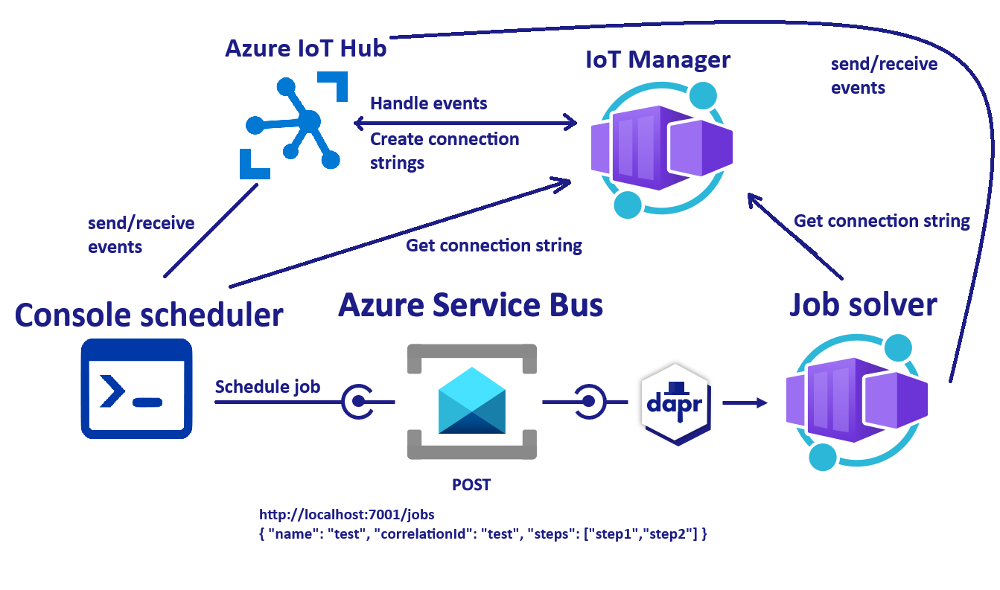

<!-- YAML front-matter schema: https://review.learn.microsoft.com/en-us/help/contribute/samples/process/onboarding?branch=main#supported-metadata-fields-for-readmemd -->

# Microservice communication using pubsub (async) and AMQP (IoT Hub)



In this quickstart, you'll create a subscriber microservice to demonstrate how Dapr enables a publish-subscribe pattern. The publisher will be a console app (`console scheduler`) that schedules a job on a specific topic, while the subscriber (`job solver`) will listen for messages of specific topics and execute the job. See [Why Pub-Sub](#why-pub-sub) to understand when this pattern might be a good choice for your software architecture.

The key thing about this sample is that both apps, the console scheduler app and the job solver app, are registered as IoT devices and send telemetry to the hub (IoT Manager). The Manager app is responsible for routing events back to devices.

All `scheduler` telemetry (device-to-cloud) is transformed to cloud-to-device messages and sent back to `solver`.

This is not the most common use of IoT Hub, but it demonstrates the messaging capabilities.

## Dapr

For more details about this quickstart example, please see the [Pub-Sub Quickstart documentation](https://docs.dapr.io/getting-started/quickstarts/pubsub-quickstart/).

Visit [this](https://docs.dapr.io/developing-applications/building-blocks/pubsub/) link for more information about Dapr and Pub-Sub.

> **Note:** This example leverages the Dapr client SDK. If you are looking for the example using only HTTP [click here](../http).

This quickstart includes one publisher - `console-scheduler`:

- Dotnet client console app `console-scheduler`

And one subscriber:

- Dotnet job-solver `job-solver`

There's also an Azure IoT Hub server app - `iot-manager`, which handles events from IoT Hub and includes a `/negotiate` API endpoint that registers IoT Devices and returns connection strings for them.

### Prerequisites

For this example, you will need:

- [Dapr CLI](https://docs.dapr.io/getting-started)
- [.NET 8 SDK](https://dotnet.microsoft.com/download)
<!-- IGNORE_LINKS -->
- [Docker Desktop](https://www.docker.com/products/docker-desktop)
<!-- END_IGNORE -->

### Deploy apps to Azure (Azure Container Apps, Azure Service Bus)

#### Deploy to Azure for dev-test

NOTE: Make sure you have Azure Dev CLI pre-reqs [here](https://learn.microsoft.com/en-us/azure/developer/azure-developer-cli/install-azd?tabs=winget-windows%2Cbrew-mac%2Cscript-linux&pivots=os-windows) and are on version 0.9.0-beta.3 or greater.

5. Run the following command to initialize the project:

```bash
azd init --template https://github.com/karpikpl/iot-hub-sample
```

This command will clone the code to your current folder and prompt you for the following information:

- `Environment Name`: This will be used as a prefix for the resource group that will be created to hold all Azure resources. This name should be unique within your Azure subscription.

6. Run the following command to package a deployable copy of your application, provision the template's infrastructure to Azure, and also deploy the application code to those newly provisioned resources:

```bash
azd up
```

This command will prompt you for the following information:
- `Azure Location`: The Azure location where your resources will be deployed.
- `Azure Subscription`: The Azure Subscription where your resources will be deployed.

> NOTE: This may take a while to complete as it executes three commands: `azd package` (packages a deployable copy of your application), `azd provision` (provisions Azure resources), and `azd deploy` (deploys application code). You will see a progress indicator as it packages, provisions, and deploys your application.

#### Azure Role Assignments

Deployment will attempt to create role assignments for the resources, as well as the identity executing the deployment. In scenarios where the `Subscription Owner` role is not available, the following role assignments have to be added manually by the admin for the **user-assigned managed identity** created during the deployment:

* `Azure Service Bus Data Sender`
* `Azure Service Bus Data Receiver`
* `Azure Container Registry Pull`
* `IoT Hub Data Contributor`
* `IoT Hub Registry Contributor`

Optional access for the user running the app locally:
* `Azure Service Bus Data Sender`
* `Azure Service Bus Data Receiver`
* `IoT Hub Data Contributor`
* `IoT Hub Registry Contributor`

#### Run the console scheduler

Once the infrastructure is deployed, `appsettings.local.json` files will be created for all projects.

To schedule a job, run `dotnet run` from the `console-scheduler` directory.

There are two other test projects that just verify Azure Web PubSub is working:
- `console-cloud` - sample demonstrating the use of IoT Hub cloud SDK.
- `console-device` - sample simulating an IoT device.

## Other Considerations

The sample could be extended to use other features of IoT Hub, including:

* [Jobs](https://learn.microsoft.com/en-us/azure/iot-hub/iot-hub-devguide-jobs)
* [Cloud to device commands](https://learn.microsoft.com/en-us/rest/api/iotcentral/dataplane/devices/run-command?view=rest-iotcentral-dataplane-2022-07-31&tabs=HTTP)
* [Messaging Considerations](https://learn.microsoft.com/en-us/azure/iot-hub/iot-hub-devguide-messaging)

## Message Delivery Guarantees

The sample uses the [Azure IoT Hub](https://learn.microsoft.com/en-us/azure/iot-hub/about-iot-hub).

1. Device-to-Cloud Message Delivery:
    * When a device sends a message to IoT Hub, the message is stored in a queue until it is processed by a backend service.
    * IoT Hub provides acknowledgment (ACK) to the device to confirm that the message has been received and stored successfully.

2. Cloud-to-Device Message Delivery:
    * When a backend service sends a message to a device, IoT Hub ensures that the message is delivered to the device.
    * IoT Hub provides acknowledgment (ACK) to the backend service to confirm that the message has been delivered to the device.
    * If the device is not connected, IoT Hub stores the message and delivers it when the device reconnects.

3. Message Redelivery on Device Restart:
    * If a device disconnects and then reconnects, IoT Hub can handle message redelivery.
    * The device can resume the connection and request any missed messages from IoT Hub. This ensures that no messages are lost during the disconnection period.

Summary:

* **Device-to-Cloud Message Delivery**: ACKs are provided to confirm message receipt by IoT Hub.
* **Cloud-to-Device Message Delivery**: ACKs are provided to confirm message delivery to the device.
* **Message Redelivery**: Supported on device restart to ensure no message loss.

These reliability features help ensure that messages are delivered as expected, even in the presence of network disruptions or device restarts.

### Device-to-Device Messages

Since device-to-cloud messages are confirmed by ACK, one way for two devices to communicate is via cloud message routing. This way, the cloud can confirm messages were delivered.

For example, if Device A sends a message to IoT Hub -> IoT Hub reads the target device ID from the message -> sends the message to Device B.

Device A gets an ACK from IoT Hub when IoT Hub successfully receives the message from A. When using IoT Hub, Device B is guaranteed to receive the message from A even if Device B is disconnected and reconnected during this period. However, if Device A is expecting some ACK from B, then B needs to send some application layer ACK message to A. Such ACK is not supported at the IoT Hub level.

The only way to achieve reliable communication between devices is to implement "read receipts", where each device confirms the message delivery.